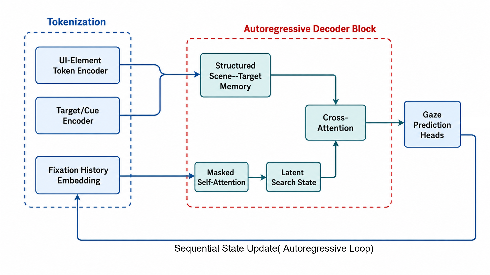
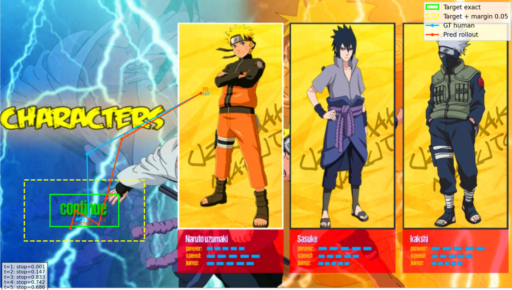

# ScanUIFormer: GUI Visual Search Scanpath Prediction
## Motivation
When people search for something on a screen, their eyes naturally move between UI elements shaped by tasks and layout. Predicting these patterns can help improve UI evaluation, accessibility, and the design of intelligent UI agents. However, many recent approaches, such as SeekUI, depend on large vision–language models that are computationally expensive for lightweight systems.

In my master thesis, the ScanUIFormer is designed as a lighter, structured alternative: an autoregressive scanpath generator that predict fixation based on prior history. The goal of this thesis project is to see how far a compact, structure-aware model can go on VSGUI10K without an LLM in the loop.

<p align="center">
  
</p>

## Results

Qualitative scanpaths on the SeekUI-aligned 232-sample subset (predicted vs. human):

<p align="center">
  
</p>

Quantitative metrics (ScanMatch, MultiMatch, NSS, stop-step accuracy) are reported in the thesis. The evaluation pipeline below reproduces them.

## Setup

```bash
pip install -r requirements.txt
```

Download VSGUI10K from <https://osf.io/hmg9b/> and place it under `data/`:

```text
data/
  vsgui10k_fixations.csv
  vsgui10k_targets.csv
  vsgui10k-images/
  segmentation/
```

Convert the raw CSVs into trial-level records (search-phase extraction, fixation filtering, coordinate normalization, target bbox alignment, validation):

```bash
python preprocessing/preprocess_official_with_validation.py
# -> data/trials_official_with_validation.jsonl.gz
```

## Training

```bash
# from scratch
python src/scanuiformer/train.py --config configs/train_from_scratch.json --freeze_patch

# continue from outputs/scanuiformer_from_scratch/last.pt
python src/scanuiformer/train.py --config configs/train_continue_from_checkpoint.json --freeze_patch
```

Checkpoints are not included in this repository.

## Evaluation

Two splits are provided: an internal all-type test split (`configs/eval_internal_alltype.json`) and a SeekUI-aligned 232-sample subset (`configs/eval_seekui232.json`).

```bash
python src/scanuiformer/evaluate.py \
  --config configs/eval_seekui232.json \
  --checkpoint outputs/scanuiformer_continue_from_checkpoint/last.pt \
  --output_dir outputs/eval_seekui232 \
  --visualize
```

See `python src/scanuiformer/evaluate.py --help` for rollout modes, thresholds, and margin sweeps. Auxiliary scripts for collecting results, adding NSS / SeekUI-bridge metrics, and per-group analysis live under `scripts/` (including example SLURM jobs).

## Citation

This repository builds on the VSGUI10K dataset and aligns its evaluation with SeekUI:

```bibtex
@article{putkonen2025vsgui10k,
  title   = {Understanding Visual Search in Graphical User Interfaces},
  author  = {Putkonen, Aini and Jiang, Yue and Zeng, Jingchun and Tammilehto, Olli and Jokinen, Jussi P. P. and Oulasvirta, Antti},
  journal = {International Journal of Human-Computer Studies},
  volume  = {199},
  pages   = {103483},
  year    = {2025},
  doi     = {10.1016/j.ijhcs.2025.103483}
}

@inproceedings{guo2026seekui,
  title     = {SeekUI: Predicting Visual Search Behavior on Graphical User Interfaces with a Reward-Augmented Vision Language Model},
  author    = {Guo, Zixin and Jiang, Yue and Leiva, Luis A. and Oulasvirta, Antti},
  booktitle = {Proceedings of the 2026 CHI Conference on Human Factors in Computing Systems},
  series    = {CHI '26},
  year      = {2026},
  publisher = {Association for Computing Machinery},
  doi       = {10.1145/3772318.3791178}
}
```
